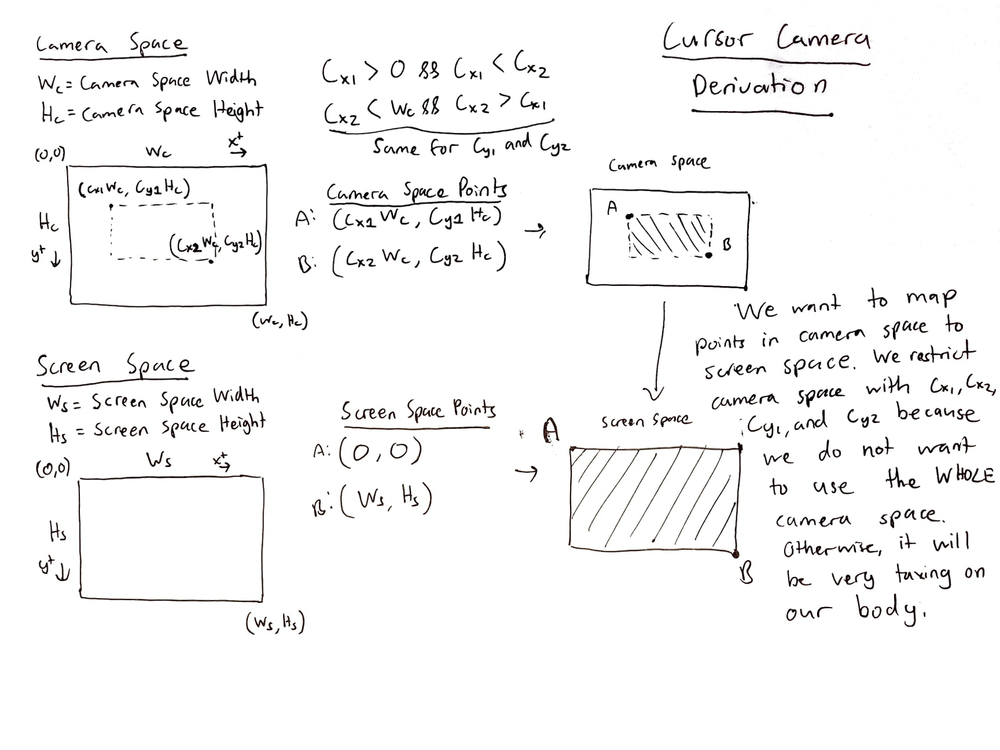
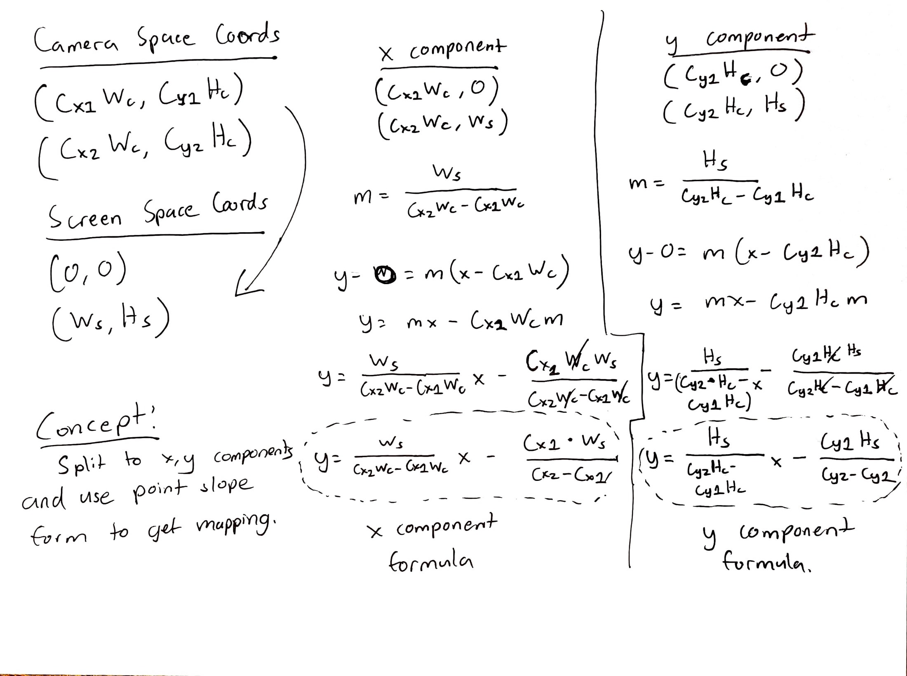

## Head Cursor Mapping Derivation

### **Problem**

How we can we derive a function where given coordinates of a head tracked in a camera, map
to the coordinates of a display in a computer screen.

The goal is to control computer cursor with the movement of the head.

### **Solution**

The photos below is a derivation of the proposed function.

In this first pic, we define some concepts and visualize this mapping.

Our head is tracked in **camera space** where a webcam is recording a frame with a defined width and height.

The cursor lies in **screen space** otherwise known as the display with a height and width.

We essentailly two planes and we have to map the coordinates of one plane to another.

In the first pic below, we have two points that define the extent of the plane in both camera and screen space.

At first, we mapped the entirety of the camera space to screen space, but by doing so, we found we had to move our head across the entire camera space to reach the edges.

This requires too much movement on the head so we had to constrict the camera space. This constriction is the reason we have constants c_x1, c_x2, c_y1, c_y2. 

c_x1 and c_x2 are the constants restricting the camera space in the x component.

c_y1 and c_y2 are the constants restricting the camera space in the y component.

With concepts and definitions set, we can finally get onto the derivation. The derivation is quite simple. 

The first step is to seperate this derivation into two components: x and y.

By seperating into components we solve for each individually.

For the x component, we take the x values of the points in screen and camera space. I have it setup so that we need to map from camera to screen using coordinates. The **x** side is the *x values of the camera* space while **y** side is the *x values of the screen space*. Do not the confuse **x** and **y** as the values of screen and camera space. I just used them as substitutes as inputs and outputs to setup the function.

With this setup, we can just use point slope form to construct a linear function. The derivation is outlined below.

The same construct is done for the y component as in the x component. So I will not repeat what is already stated.

